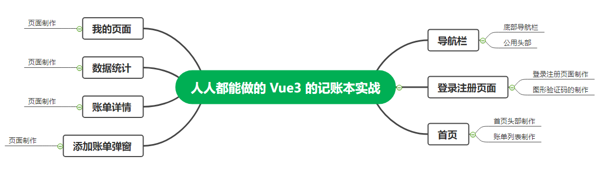
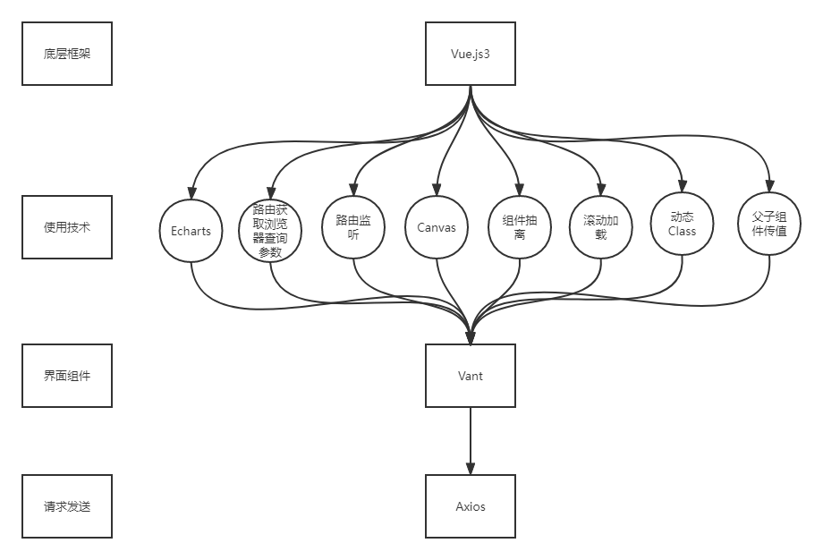

# 人人都能做的 Vue 3 记账本实战

## 项目简介

### 定位

记账本主要功能用于使用者可以在手机端登录账号，然后方便的进行记账等功能。

### 特色

在线的 API，最新版本的 Vue3，优秀漂亮的界面，以及手机端的适配。

### 项目架构

#### 项目结构图

#### 技术架构图

### 一般约束

1. 开发环境约束：
    - 开发工具：VSCode 或 WebStorm
    - 开发语言：HTML5、JavaScript、Vue.js
2. 时间约束：项目开发周期为 2 个工作日，需要开发者合理规划时间。
3. 技术约束：HTML5、CSS3、JavaScript、Canvas、Echarts、Vant、Axios。
4. 其他约束：开发者需在完成项目需求的前提下，考虑编码规范、页面优化等因素。

### 项目预览

